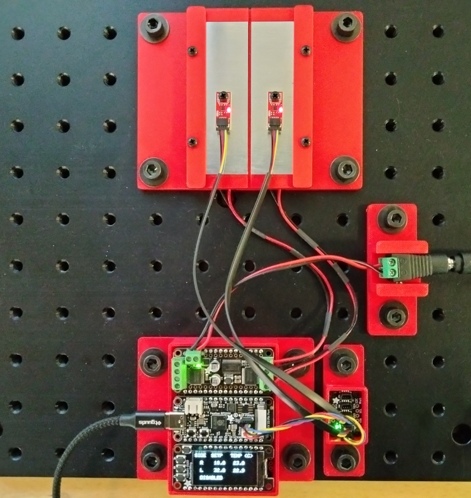
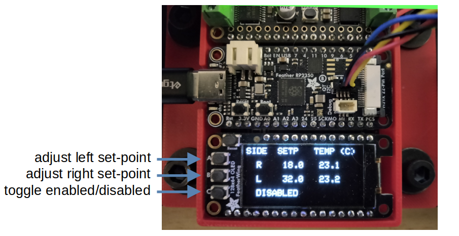
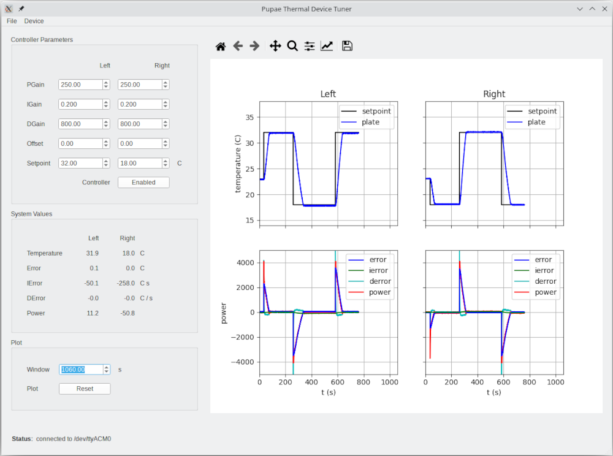

## pupae_thermal_device  

A temperature controller for thermal experiments with
Drosophila melanogaster pupea. This device consists of two almuminum plates
separated by a narrow channel in which pupae are placed. Each aluminum plate
has a temperature sensor on the upper surface and sits a Peltier thermoelectric
module.  The temperature of the plates is controlled independently using a
feedback (PID) temperature controller implemented on the an Adafruit Feather
RP2350 in combination with the Adafruit DC Motor Featherwing and Sparkfun's
micro STTS22H temperature sensor. The set-points, plate temperatures and
enabled/disable status are displayed on an Adafruit OLED Featherwing. The three
(A, B, C) buttons on the OLED Fetherwing are used to control the plate set-point temperatures 
and to toggle the controller's enabled/disabled state.

## License: 
Creative Commons Attribution 4.0 International CC BY 4.0

## Device Image 

## OLED display and control buttons

## Controller tuning GUI 

